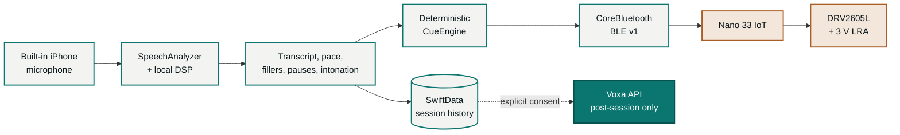

<div align="center">
  <picture>
    <source media="(prefers-color-scheme: dark)" srcset="design/brand/02_primary_logo_white_text.png" />
    <source media="(prefers-color-scheme: light)" srcset="design/brand/01_primary_logo_dark_text.png" />
    
  </picture>

  <p><strong>SPEAK · CONNECT · CONTROL</strong></p>
  <p>
    Discreet guidance. Confident delivery.
  </p>
  <p>Voxa Cue is an AI speech coach measured on your iPhone and felt on your wrist.</p>

  <p>
    
    
    
    
  </p>

  <p>
    <a href="#the-product">Product</a> ·
    <a href="#architecture">Architecture</a> ·
    <a href="#brand-system">Brand</a> ·
    <a href="#quick-start">Quick start</a> ·
    <a href="#verification">Verification</a> ·
    <a href="#documentation">Docs</a>
  </p>
</div>

---

> [!IMPORTANT]
> Voxa Cue is phone-first. The built-in iPhone microphone is the only audio source, the live coaching loop runs entirely on-device, and raw audio is never uploaded. There is no Raspberry Pi or external microphone in the MVP.

## The product

Presenters often rush, repeat filler words, or lose track of time precisely when looking at another screen would be most distracting. Voxa Cue closes that feedback gap with a private coaching loop:

1. The iPhone listens during a presentation.
2. On-device speech and signal processing measure delivery in real time.
3. A deterministic cue engine decides whether feedback is warranted.
4. The phone maps that decision to a physical pulse and sends it over Bluetooth Low Energy.
5. The Cue Band delivers a distinct, discreet vibration.
6. The app saves the session and turns it into an actionable practice plan.

<table>
  <tr>
    <td align="center" width="20%"><br /><strong>Confidence</strong></td>
    <td align="center" width="20%"><br /><strong>Timing</strong></td>
    <td align="center" width="20%"><br /><strong>Analytics</strong></td>
    <td align="center" width="20%"><br /><strong>Haptics</strong></td>
    <td align="center" width="20%"><br /><strong>Pace</strong></td>
  </tr>
</table>

| Live coaching | Post-session improvement |
| --- | --- |
| Speaking pace and persistence | Evidence-based session summary |
| Contextual filler bursts | Pace, filler, pause, timing, and talk-ratio analytics |
| 50% and target-time defaults; optional 75% and 90% cues | Descriptive intonation and energy trends |
| Private haptic delivery acknowledgements | Longitudinal session history |

### A configurable haptic language

| Cue | Meaning |
| --- | --- |
| Slow down | Pace has remained above the personalized range |
| Pick up the pace | Pace has remained below the personalized range |
| Filler cluster | A contextual filler burst was detected |
| Halfway point | Half of the target time has elapsed |
| 75% used | Three quarters of the target time has elapsed |
| 90% used | The presentation is entering its closing window |
| Target reached | The configured presentation time has elapsed |

Slow down, filler cluster, halfway, and target reached are enabled by default. The
other cues are opt-in under Advanced. Every cue can use any pulse preset and a
soft, medium, or strong intensity. Filler clusters default to two detected
fillers within five seconds. The presenter can require two to six fillers and
choose a five- to 30-second lookback window. A 30-second filler reset,
persistence thresholds, and cue priority prevent noisy or conflicting feedback.

## Architecture



The live path never waits for a network request. If Bluetooth disconnects, recording and analytics continue. The optional API is used only for post-session coaching after explicit consent.

### Data boundaries

| Boundary | What crosses it | What never crosses it |
| --- | --- | --- |
| Microphone → app memory | PCM buffers during an active session | Retained audio files |
| iPhone → Cue Band | Physical pattern ID, intensity, repeat count, sequence | Audio, transcript, identity |
| iPhone → insight API | Confirmed transcript, aggregate metrics, and cue summaries | Raw audio |
| Voxa API → OpenAI | Text required for the requested structured result | App bearer token, BLE data, raw audio |

The API rejects audio-shaped payloads and requests structured outputs with provider application-state storage disabled. OpenAI abuse-monitoring retention remains an explicit production release decision.

## Technology

| Layer | Libraries and frameworks |
| --- | --- |
| iPhone app | SwiftUI, Observation, SwiftData, SpeechAnalyzer, AVAudioEngine, CoreBluetooth |
| Shared iOS logic | Swift 6 package with pure cue, transcript, timing, and analytics modules |
| API | Hono, strict TypeScript, Zod, OpenAI Responses API with `gpt-5.6-luna`, Vitest, Vercel |
| Wearable | Arduino Nano 33 IoT with ArduinoBLE, DRV2605L, and PlatformIO; Nano ESP32 remains supported |
| Contracts | JSON Schema plus a versioned six-byte command and seven-byte status BLE protocol |

## Brand system

The product system pairs the band’s industrial graphite with warm ivory surfaces, voice-signal teal, and haptic copper. Color communicates function instead of decorating generic “AI” surfaces.

| Token | Value | Role |
| --- | --- | --- |
| Voice Signal | `#0B756F` | Listening, analysis, and primary action |
| Haptic Copper | `#A85E24` | Physical wrist cues and tactile emphasis |
| Graphite | `#0B171B` | Hardware anchor, wordmark, and primary text |
| Warm Ivory | `#F3F4F1` | Quiet canvas |
| Signal Surface | `#E0EFEB` | Selected and secondary states |

The original source toolkit remains versioned in [`design/brand`](design/brand); the app’s current semantic palette is implemented in `CueTheme.swift`. The language system is **“Speak · Connect · Control”**, **“Guided by rhythm. Powered by precision.”**, and **“Discreet guidance. Confident delivery.”**

## Repository

```text
voxa-cue/
├── api/                         Hono API and OpenAI integration
├── contracts/                   JSON schemas and normative BLE v1 contract
├── design/brand/                Complete Concept 3 brand toolkit
├── docs/                        Architecture, privacy, support, and release gates
├── firmware/voxa-wearable/      Nano 33 IoT / Nano ESP32 haptic firmware
├── firmware/imu-diagnostic/     Standalone Nano 33 IoT IMU lab firmware
├── ios/
│   ├── Packages/VoxaKit/        Reusable VoxaCore and VoxaRuntime modules
│   ├── VoxaCue/                 SwiftUI application
│   ├── VoxaCueTests/            App coordination behavior tests
│   └── project.yml              XcodeGen project definition
├── tools/                       BLE and IMU browser diagnostics
└── package.json                 Unified build and verification commands
```

## Quick start

### Verify the entire system

Requirements: Xcode 27 with the iOS 26+ SDK, XcodeGen, Node.js 22+, pnpm 10.32.1, and `uvx`.

```sh
pnpm install --frozen-lockfile
pnpm verify
```

That single command type-checks, tests, and builds the API, runs package and simulator app tests, validates both Debug and credential-free Release iOS builds, lints the privacy manifest, and verifies native plus both Nano firmware targets.

### Launch the iPhone app

```sh
pnpm ios:generate
open -a /Applications/Xcode-beta.app ios/VoxaCue.xcodeproj
```

In Xcode:

1. Select an iPhone running iOS 26+ or an iOS simulator.
2. For a physical device, connect and unlock it, trust the Mac, enable Developer Mode, and select an Apple development team under **Signing & Capabilities**.
3. Add `-demoScenario` under **Scheme → Run → Arguments** for deterministic, clearly labeled demo data.
4. Press **Run**.

The demo requires no microphone, band, or API. Remove `-demoScenario` to exercise the real recording flow.

<details>
<summary><strong>Configure the optional AI API</strong></summary>

The app records, analyzes speech, and drives haptics without the API. Optional post-session coaching requires a server-side OpenAI key.

```sh
cp api/.env.example api/.env.local
pnpm api:dev
```

Set:

- `OPENAI_API_KEY` to a server-side key
- `OPENAI_MODEL=gpt-5.6-luna` for the current cost-sensitive structured coaching model
- `VOXA_BUILD_ID` to the deployment commit SHA or release identifier
- `VOXA_DEMO_API_TOKEN` to a random bearer token of at least 32 characters

Deploy with `api/` as the Vercel project root. `GET /livez` is a public minimal liveness probe; `/health`, `/readyz`, and AI routes require `Authorization: Bearer <token>`. This shared token is only for the closed prototype and is not production user authentication.

For an AI-enabled app build, copy `ios/Config/BuildSettings.xcconfig.example` to ignored `ios/Local.xcconfig`, then set the deployed HTTPS origin and matching bearer token. Provider credentials never belong in the app.

</details>

<details>
<summary><strong>Flash and pair the Cue Band</strong></summary>

Wire the Nano 33 IoT, DRV2605L breakout, and 3 V LRA using the safety notes in [the firmware guide](firmware/voxa-wearable/README.md). Update the board's NINA-W102 connectivity firmware to 3.0.0 or newer before the first BLE test.

```sh
cd firmware/voxa-wearable
uvx --with pip platformio run -e nano_33_iot --target upload
uvx --with pip platformio device monitor --baud 115200
```

The serial monitor should print `Voxa Cue firmware 1.1 ready`. In the app, open **Settings → Device Lab**, scan, connect, and send a test command.

</details>

## Demonstration flow

1. Launch with `-demoScenario` for a software-only walkthrough, or connect the physical Cue Band.
2. Verify all nine physical haptic patterns in Device Lab.
3. Start a session using the iPhone microphone.
4. Set target time, pace range, enabled cues, and intensity.
5. Present while Voxa Cue measures delivery and acknowledges any haptic commands.
6. End the session to inspect analytics, transcript evidence, priorities, and drills.

## Verification

The current implementation is exercised across all three layers:

| Surface | Verified behavior |
| --- | --- |
| API | Strict TypeScript plus contract and failure-path tests |
| VoxaCore + VoxaRuntime | Swift behavior tests for metrics, timing, cue logic, microphone-route enforcement, BLE bytes, persistence, and API payloads |
| iPhone application | Simulator behavior tests plus unsigned Debug and Release generic-device builds |
| Firmware | Native protocol and pattern tests plus successful Nano 33 IoT and Nano ESP32 builds |
| IMU lab | Native packet/sensor tests, browser classifier tests, and a Nano 33 IoT build |
| Release configuration | Privacy manifest lint plus a built Info.plist check proving the shared demo token is empty |

Physical BLE, motor calibration, microphone placement, and wear testing are intentionally tracked as hardware gates in the release checklist.

## Documentation

| Document | Purpose |
| --- | --- |
| [Setup guide](docs/SETUP_GUIDE.md) | Exact tools, wiring, secrets, deployment, costs, and physical checks |
| [Backend audit](docs/BACKEND_AUDIT.md) | Closed-prototype verdict and public-release gaps |
| [Product architecture](docs/PRODUCT_ARCHITECTURE.md) | Runtime data flow, trust boundaries, and failure behavior |
| [BLE protocol v1](contracts/ble-v1.md) | Normative UUIDs, packet bytes, statuses, and replay rules |
| [Firmware guide](firmware/voxa-wearable/README.md) | Wiring, flashing, calibration, and safety |
| [Privacy policy](docs/PRIVACY_POLICY.md) | Prototype data practices |
| [Support](docs/SUPPORT.md) | Compatibility and troubleshooting |
| [App Review notes](docs/APP_REVIEW_NOTES.md) | Reviewer walkthrough and AI disclosures |
| [Release checklist](docs/RELEASE_CHECKLIST.md) | Demo, hardware, privacy, legal, and distribution gates |

---

<div align="center">
  
  <br />
  <strong>SPEAK · CONNECT · CONTROL</strong>
  <br />
  <strong>Built for the University of Pennsylvania Management & Technology Summer Institute.</strong>
  <br />
  Voxa Cue is a working MVP prototype, not a medical, safety, or accessibility device.
</div>
